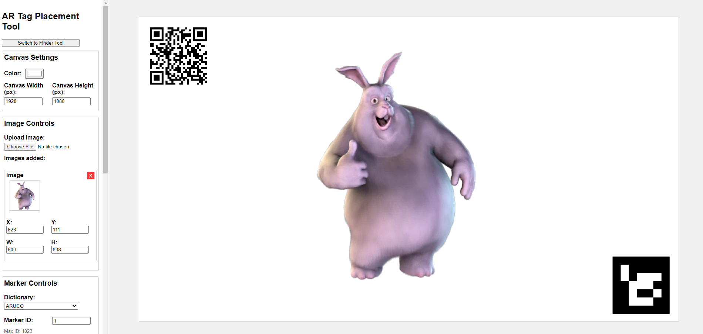
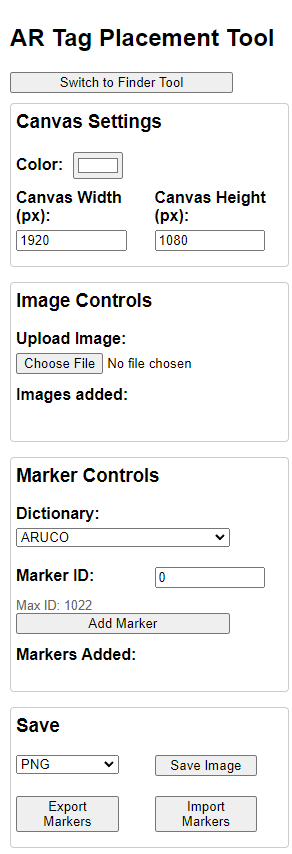
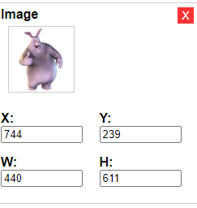
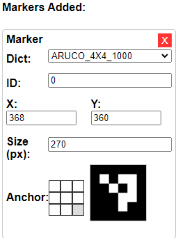
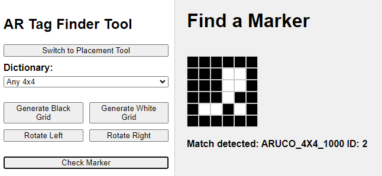

# AR Tag Placement and Finder Tool

## [Link to github-page hosted application](https://bbelk.github.io/ArUcoPlacementTool/)

## Table of Contents
1. [Description](#description)
2. [Supported Dictionaries](#supported-dictionaries)
3. [Placement Tool](#placement-tool)
   - [Canvas Settings](#canvas-settings)
   - [Image Controls](#image-controls)
   - [Marker Controls](#marker-controls)
   - [Saving and Importing](#saving-and-importing)
4. [Finder Tool](#finder-tool)
5. [Acknowledgements](#acknowledgements)

## Description

The **AR Tag Placement and Finder Tool** is a minimalist image editor designed for seamlessly placing augmented reality (AR) tags, such as ArUco and AprilTags, as well as QR codes, into images. This tool allows users to generate markers that can be easily positioned, scaled, and customized by selecting different dictionaries and IDs or data.

Key Features:
- **Marker Management:** Create, edit, and manage AR tags and QR codes with precision.
- **Export/Import:** Save marker configurations to JSON for easy reuse and sharing.
- **Finder Tool:** Locate specific markers within images by selecting grid cells and matching patterns.

**Supported Dictionaries:**

### ArUco Dictionaries
- ArUco 4x4 1000
- ArUco 5x5 1000
- ArUco 6x6 1000
- ArUco 7x7 1000
- ArUco Default OpenCV
- ArUco MIP 16h3
- ArUco MIP 25h7

### AprilTag Dictionaries
- AprilTag 16h5
- AprilTag 25h7
- AprilTag 25h9
- AprilTag 36h9
- AprilTag 36h10
- AprilTag 36h11

### Other Dictionaries
- ARTag
- ARToolKitPlus
- ARToolKitPlus BCH
- Chilitags
- QR Codes

## Placement Tool

The Placement Tool provides intuitive controls for customizing your AR tag layouts.

### Canvas Settings
- **Background Color:** Choose the canvas's background color to suit your project needs.
- **Dimensions:** Set the width and height of the canvas. These settings are saved alongside markers when exporting.

### Image Controls
Upload images to place within the canvas:
- **Uploading:** Drag and drop or select image files to add them to the canvas.
- **Image Object:** Each uploaded image appears as an Image Object, allowing for:
  - **Positioning:** Drag the image around the canvas or enter precise X and Y coordinates.
  - **Scaling:** Adjust the image's width and height while maintaining its aspect ratio.

> **Note:** Image Objects are not included when exporting markers.

### Marker Controls
Manage your AR tags and QR codes:
- **Selecting Dictionary:** Choose from supported dictionaries or select QR Code.
- **Setting ID/Data:** Enter an integer ID for ARUco/AprilTag markers or input text/URL for QR Codes.
- **Adding Markers:** Click "Add Marker" to place a new Marker Object onto the canvas.

Marker Object Features:
- **Dictionary Selection:** Switch between different marker dictionaries, including QR Codes.
- **ID/Data Input:** Assign specific IDs or data to markers.
- **Positioning:** Set the X and Y coordinates relative to the canvas.
- **Anchoring:** Choose how the marker's position is represented (e.g., top-left, center, bottom-right).
  - **Functionality:** Changing the anchor alters the marker's representation without affecting its actual position.
- **Size Adjustment:** Modify the marker's size with pixel snapping to ensure markers remain recognizable and aligned with the grid.

### Saving and Importing
- **Save Image:** Export the composite image in PNG, JPG, or WEBP formats.
- **Export Markers:** Save the current canvas settings and all markers to a JSON file (`markers.json`).
- **Import Markers:** Load a JSON file to recreate previously saved marker layouts.

## Finder Tool

The Finder Tool is a versatile feature designed for:
- **Identifying Unknown Markers:** Locate specific AR tags or QR Codes within images.
- **Exploring Dictionaries:** Experiment with different dictionaries to understand marker patterns.

### "Any" Usage:
- **Grid Selection:** Choose the grid size (excluding border squares) to match your marker's specifications.
- **Manual Selection:** Click on grid cells to define the pattern you're searching for.
- **Searching "Any"** Click the 'Check Marker" button to search through groups of dictionaries with matching selected size

- **Dictionary Selection:** Opt for a specific dictionary or an "Any" group to broaden the search scope.
- **Searching Specific Dictionary** The chosen specific dictionary is automatically searched when clicking cells in grid.
  - **Performance:** Selecting a single dictionary ensures faster searching, while multiple dictionaries may cause performance delays.
- **Rotation:** Rotate the grid left or right to match markers with unknown orientations.

> **Tip:** Use the Finder Tool to recover markers with forgotten IDs or to identify markers encountered in real-world applications.

## Acknowledgements

This project utilizes [js-aruco2](https://github.com/damianofalcioni/js-aruco2) by Damiano Falcioni for generating markers with JavaScript. Thanks Damiano!

---

© 2024 Bruce Belk
